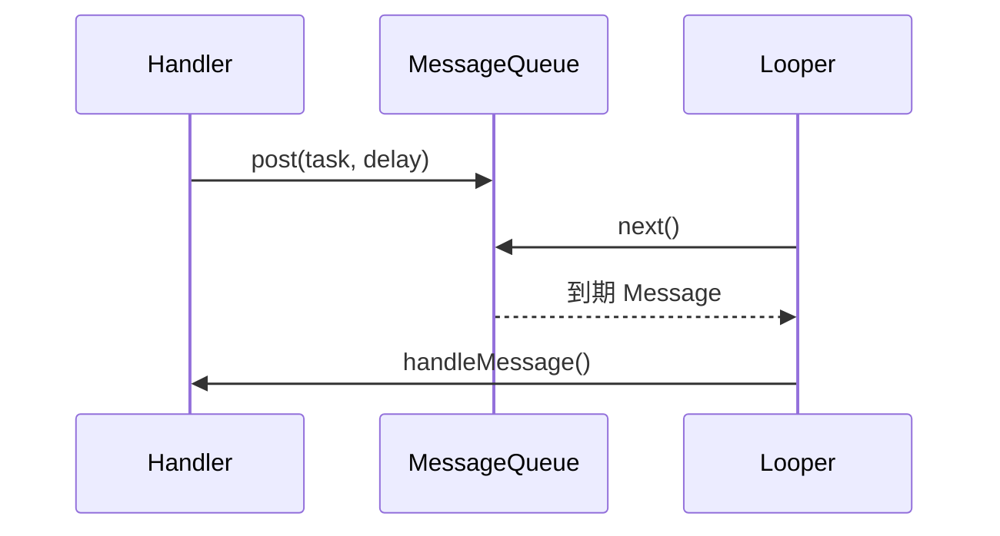

# Handler、Looper 与 MessageQueue：主线程的事件泵

> 一条延迟消息没有被移除，就可能把已经销毁的页面重新带回内存。

**Type:** Build
**Languages:** Python
**Prerequisites:** 04-process-thread-and-ipc
**Time:** ~90 分钟

## 学习目标

- 描述 `Handler`、`MessageQueue` 与 `Looper.loop()` 的职责
- 解释主线程为何天然拥有 Looper
- 在后台线程中正确建立消息循环
- 验证消息按到期时间而非投递顺序执行
- 在组件销毁时清理延迟回调

## 概念

`Handler.post()` 和 `sendMessage()` 向消息队列投递工作；`Looper.loop()` 持续取出到期消息，并把它们交给目标 Handler。主线程已由框架准备 Looper；后台线程需要显式 `Looper.prepare()`。



页面、View 或 Activity 销毁时，应移除不再需要的 `Runnable` 与 Message，避免匿名回调长时间强引用页面。

## 构建它

`MessageQueueSimulator` 用确定性毫秒时间戳模拟投递、取出、移除和后台 Looper 准备状态。

```bash
cd phases/21-java-android-foundations/05-handler-looper-and-concurrency/code
python3 main.py
python3 -m unittest discover tests -v
```

## 诊断练习

若崩溃只在旋转屏幕或返回页面后出现，检查旧页面的 Handler 是否仍有延迟消息；优先把回调绑定到生命周期，而不是延长 Activity 的存活时间。

## 发布它

消息队列排查步骤见 `outputs/skill-handler-queue-audit.md`。
