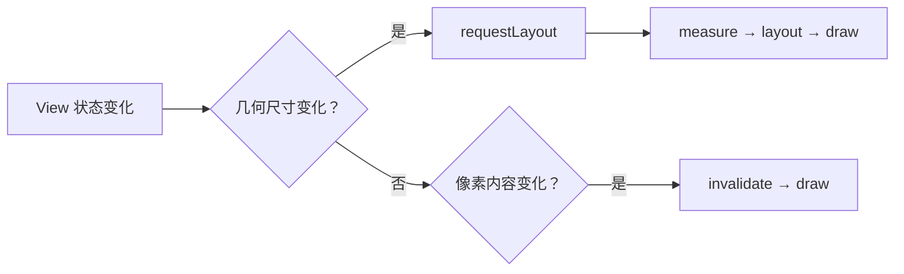

# View 渲染、Surface 与触摸事件分发

> 卡顿与滑动冲突通常不在某一个回调里，而在测量、布局、绘制与事件所有权的交界处。

**Type:** Build
**Languages:** Python
**Prerequisites:** 05-handler-looper-and-concurrency
**Time:** ~90 分钟

## 学习目标

- 区分普通 `View`、`SurfaceView`、`TextureView` 与 `GLSurfaceView`
- 说明 measure、layout、draw 的调用责任
- 区分 `requestLayout()` 与 `invalidate()`
- 追踪 `dispatchTouchEvent()`、拦截和 `onTouchEvent()` 的关系
- 为方向不同或相同的嵌套滚动选择事件归属

## 概念

普通 View 在窗口的 View 树中绘制；`SurfaceView` 拥有独立 Surface，适合相机预览、视频或高频渲染，但在叠放、透明和动画上有额外限制。



触摸序列从 `ACTION_DOWN` 开始。父容器接管后，子 View 会收到 `ACTION_CANCEL`；若子 View 不消费 DOWN，通常不会收到后续事件。

## 构建它

本课用 `RenderRequest` 给出渲染计划，用 `TouchDispatcher` 记录父级拦截时发出的 CANCEL。

```bash
cd phases/21-java-android-foundations/06-view-rendering-and-touch/code
python3 main.py
python3 -m unittest discover tests -v
```

## 诊断练习

不要在高频动画中反复调用 `requestLayout()`。先确认变化是尺寸还是像素，再选择对应 API；嵌套滚动优先使用官方 Nested Scrolling 体系。

## 发布它

渲染与触摸冲突检查卡见 `outputs/skill-view-event-trace.md`。
