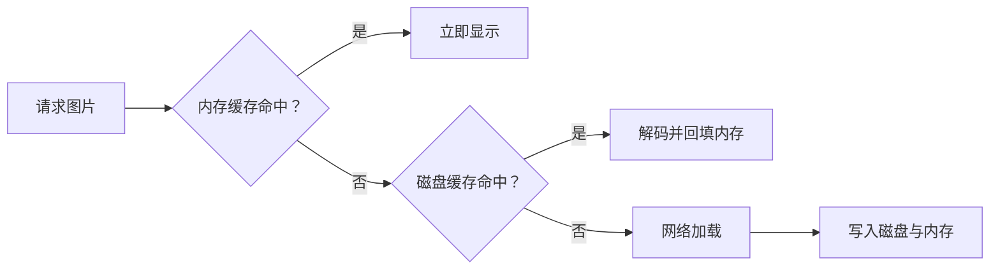

# RecyclerView、列表复用与图片缓存

> 列表性能问题经常来自“每一项都很小”的重复工作，而不是某一行的明显慢函数。

**Type:** Build
**Languages:** Python
**Prerequisites:** 06-view-rendering-and-touch
**Time:** ~90 分钟

## 学习目标

- 比较 `ListView` 与 `RecyclerView` 的布局和更新能力
- 为嵌套列表选择复用池、预取和局部更新策略
- 说明 `DiffUtil` 与全表刷新的差异
- 解释内存、磁盘、网络三级图片缓存顺序
- 避免把软引用作为主缓存策略

## 概念

`RecyclerView` 通过 `LayoutManager`、`ViewHolder`、`ItemAnimator` 与局部 `notifyItem...()` 更新支持更多列表形态。嵌套横向列表可共享 `RecycledViewPool`；固定尺寸列表可在语义允许时调用 `setHasFixedSize(true)`。



源资料强调：软引用回收时机不可控，不能作为主要缓存。按目标尺寸解码、避免频繁创建 Bitmap、让成熟库管理取消和生命周期，才是稳定策略。

## 构建它

`ListPerformanceAdvisor` 输出局部更新建议；`ImageCache` 以 memory → disk → network 的固定次序模拟真实缓存层。

```bash
cd phases/21-java-android-foundations/07-list-rendering-and-image-cache/code
python3 main.py
python3 -m unittest discover tests -v
```

## 诊断练习

若滑动掉帧，先用 Profiler 或 Perfetto 测量绑定耗时、GC、布局次数和图片解码，不要把 `setNestedScrollingEnabled(false)` 当作通用开关。

## 发布它

列表性能检查清单见 `outputs/skill-list-cache-triage.md`。
