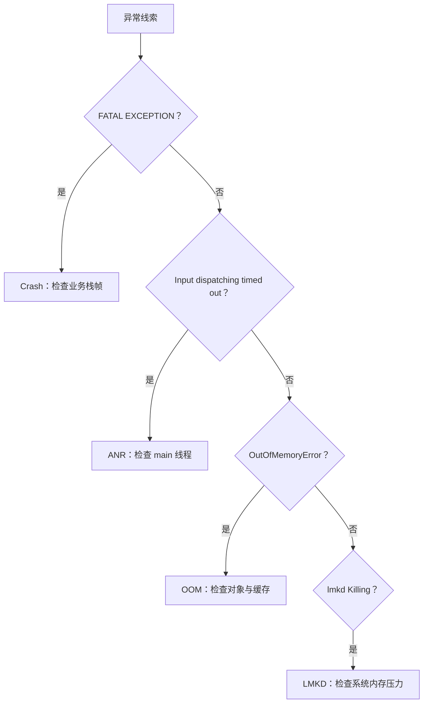

# 内存泄漏、OOM 与 ANR：不要混淆三种事故

> “应用卡死”可能是主线程、内存、系统回收或异常崩溃中的任一种；先分类，才能修复。

**Type:** Build
**Languages:** Python
**Prerequisites:** 07-list-rendering-and-image-cache
**Time:** ~90 分钟

## 学习目标

- 区分内存泄漏、OOM、ANR 与 LMKD 回收
- 从静态对象、Handler、监听器和任务定位泄漏链路
- 说明主线程工作为何会触发 ANR
- 选择适合的内存与性能诊断工具
- 为页面销毁设计资源清理动作

## 概念

内存泄漏是对象不再需要却仍被强引用；OOM 是进程申请内存失败，可能由泄漏、超大对象或失控缓存直接引起；ANR 是组件在规定时间内无法响应。LMKD 则是系统在内存压力下主动回收进程，不等同于 Java 崩溃。



常见修复包括用 `Application` Context 替代静态 Activity、移除延迟回调、注销观察者、取消线程和动画、显式关闭 Cursor、流和数据库资源。

## 构建它

`IncidentClassifier` 根据精确日志短语分类事故，`leak_remedy()` 把典型引用链映射到生命周期动作。

```bash
cd phases/21-java-android-foundations/08-memory-oom-and-anr/code
python3 main.py
python3 -m unittest discover tests -v
```

## 诊断练习

`nativePollOnce` 出现在主线程中通常意味着它在等待消息，并不能单独证明卡死。应结合 ANR Reason、业务栈、锁等待、Binder 调用和 CPU 状态判断。

## 发布它

事故分类与泄漏排查卡见 `outputs/skill-memory-anr-triage.md`。
