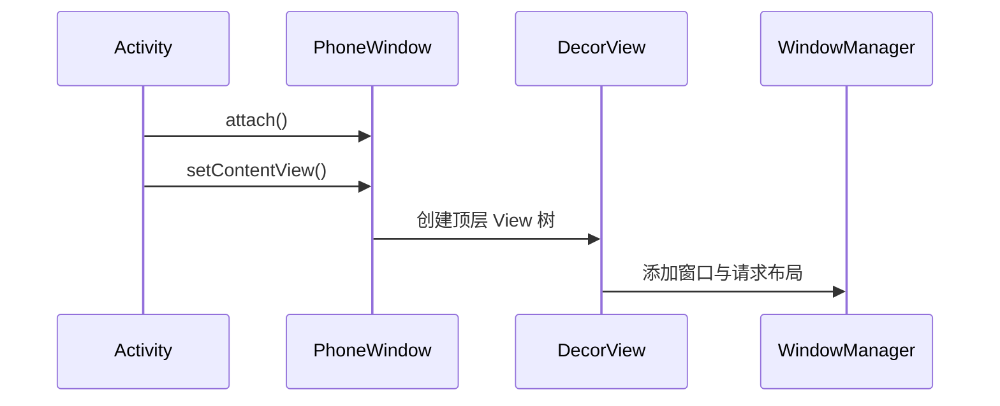

# Activity、Fragment、Window 与 Service 生命周期

> 组件生命周期不是固定的“回调背诵表”，而是系统资源管理和状态恢复的契约。

**Type:** Build
**Languages:** Python
**Prerequisites:** 08-memory-oom-and-anr
**Time:** ~90 分钟

## 学习目标

- 追踪 Activity 前台、后台、恢复与销毁路径
- 在停止状态保存可恢复状态而非依赖 `onDestroy()`
- 区分 Fragment 实例生命周期与 View 生命周期
- 解释 Activity、PhoneWindow、DecorView 与 WMS 的分工
- 为启动模式和 Service 类型选择正确语义

## 概念

Activity 常见进入前台路径是 `onCreate → onStart → onResume`；返回前台时会经过 `onRestart`。系统可能直接终止已停止进程而不回调 `onDestroy()`，关键状态应通过 `ViewModel`、`SavedStateHandle` 或保存状态恢复。



`singleTop` 仅在目标位于栈顶时复用并回调 `onNewIntent()`；`singleTask` 会复用任务中的既有实例并清除其上方页面。长期用户可见任务应使用前台服务，短时延后任务更适合 `WorkManager`。

## 构建它

本课实现生命周期与启动模式规划器，分别输出回调序列、重用策略和 Service 选择。

```bash
cd phases/21-java-android-foundations/09-activity-window-and-service/code
python3 main.py
python3 -m unittest discover tests -v
```

## 诊断练习

Fragment 视图销毁后仍更新界面，通常是观察者绑定到了 Fragment 实例而不是 `viewLifecycleOwner`。修复时不要延长 View 生命周期，应缩小观察者的生命周期。

## 发布它

组件生命周期检查卡见 `outputs/skill-component-lifecycle.md`。
