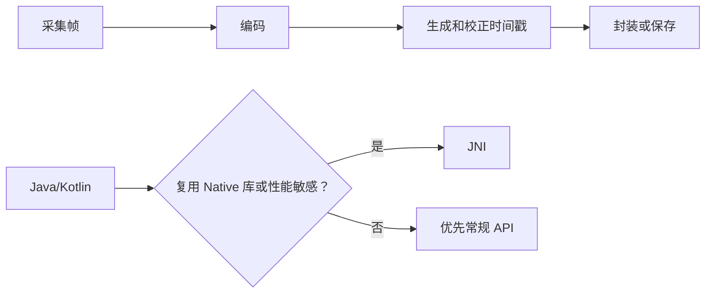

# 多媒体、JNI、网络与安全边界

> 选择 JNI 或加密算法前，先回答：真正的性能瓶颈和安全目标是什么？

**Type:** Build
**Languages:** Python
**Prerequisites:** 09-activity-window-and-service
**Time:** ~90 分钟

## 学习目标

- 描述相机、音视频采集、编码和封装的关键阶段
- 判断何时 JNI 的复杂度是合理成本
- 区分 TCP、UDP、Socket、HTTP 与 Web Service
- 按数据量、签名和完整性需求选择密码学工具
- 避免将 MD5/SHA-1 用作新的安全方案

## 概念

相机预览通常绑定 Surface 输出，帧可能是 `YUV_420_888` 或 NV21；视频编码可用 `MediaCodec`，封装可用 `MediaMuxer` 或 `MediaRecorder`。时间戳是音视频同步不可省略的部分。



TCP 追求可靠、有序字节流；UDP 追求低开销、低延迟但不保证到达。AES 适合大数据；RSA/ECC 常用于签名或密钥协商；密码存储应使用专用 KDF，而不是裸 SHA-256。

## 构建它

本课的 `TransportAdvisor`、`CryptoAdvisor`、`MediaPipeline` 和 `jni_is_justified()` 把这些边界写成可测试决策。

```bash
cd phases/21-java-android-foundations/10-media-jni-network-and-security/code
python3 main.py
python3 -m unittest discover tests -v
```

## 诊断练习

当 JNI 崩溃难以复现时，检查 ABI、线程附着、异常处理、所有权和本地库加载顺序；不要把 JNI 当作“Java 太慢”的默认答案。

## 发布它

协议与安全选型卡见 `outputs/skill-media-network-security.md`。
