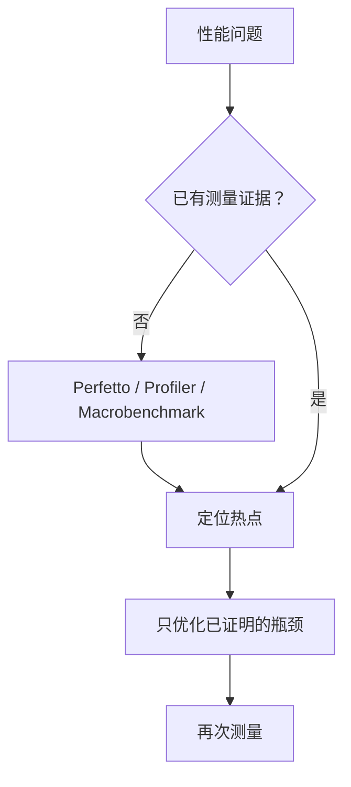

# 架构、性能优化与跨进程存储

> 性能优化的第一步不是改代码，而是用正确工具证明瓶颈在哪里。

**Type:** Build
**Languages:** Python
**Prerequisites:** 10-media-jni-network-and-security
**Time:** ~90 分钟

## 学习目标

- 比较 MVC、MVP 与 MVVM 的职责边界
- 选择适合可观察 UI 状态的架构形态
- 以测量优先顺序制定性能优化计划
- 列出布局、启动、内存、包体的常见优化方向
- 解释为什么 SharedPreferences 不是可靠的多进程数据源

## 概念

MVC 容易让 Activity/Fragment 同时膨胀为 View 和 Controller；MVP 让 Presenter 协调被动 View；MVVM 让 View 观察 ViewModel 暴露的状态，且 ViewModel 不应持有 View 引用。



优化方向包括减少过度绘制和嵌套、延后非首帧工作、限制缓存、删除无用资源和依赖。跨进程共享数据时，`SharedPreferences` 的每进程缓存不保证一致性；应选 ContentProvider、Binder/AIDL 或单写入进程。

## 构建它

`ArchitectureAdvisor` 为需求选择架构，`OptimizationPlan` 强制先测量，`cross_process_storage()` 拒绝把 SharedPreferences 当多进程数据库。

```bash
cd phases/21-java-android-foundations/11-architecture-performance-and-storage/code
python3 main.py
python3 -m unittest discover tests -v
```

## 诊断练习

如果两个进程读到不同偏好值，不要启用已废弃的 `MODE_MULTI_PROCESS`。应重建数据边界，并让单一权威端负责写入。

## 发布它

架构与性能决策清单见 `outputs/skill-architecture-performance.md`。
