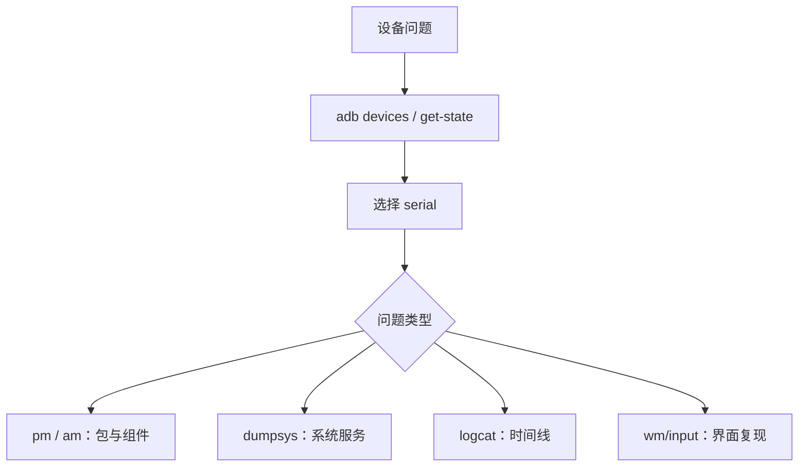

# Linux、ADB 与设备操作安全

> 诊断命令应该缩小问题范围，而不是扩大设备状态变化的范围。

**Type:** Build
**Languages:** Python
**Prerequisites:** 12-binder-classloading-build-and-install
**Time:** ~90 分钟

## 学习目标

- 为多设备场景构造带序列号的 ADB 命令
- 使用 `pm`、`am`、`dumpsys` 和 Logcat 获取系统证据
- 区分设备连接、安装、组件启动与屏幕输入命令
- 在 SELinux、root、remount 操作前识别风险
- 拒绝未限定路径的递归删除命令

## 概念

多台设备时应使用 `adb -s <serial>`，避免将诊断和部署打到错误设备。`pm` 查询包状态，`am` 启动组件或广播，`dumpsys` 输出系统服务快照；不同 Android 版本的输出格式会变化，应按当前设备结果分析。



`rm -rf *`、`setenforce 0`、`adb root` 和 `adb remount` 都具有强副作用。资料明确要求：在受控设备上使用，并在前后确认目标、权限和恢复方式。

## 构建它

本课只生成命令字符串，不连接任何设备。`AdbCommandPlanner` 添加设备序列号与过滤条件；`is_safe_shell_command()` 拒绝未限定递归删除。

```bash
cd phases/21-java-android-foundations/13-linux-adb-and-device-operations/code
python3 main.py
python3 -m unittest discover tests -v
```

## 诊断练习

排查当前前台页面时，先看 `dumpsys window` 的 `mCurrentFocus`，再结合 Activity 状态和包名，不要依赖某个版本固定的单行输出。

## 发布它

安全 ADB 诊断清单见 `outputs/skill-adb-safe-operations.md`。
