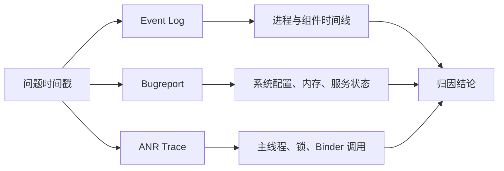

# 系统诊断日志、ANR、LMKD 与稳定性测试

> 诊断不是搜几个泛关键词，而是把异常时间、进程、栈和系统压力连成一条证据链。

**Type:** Build
**Languages:** Python
**Prerequisites:** 13-linux-adb-and-device-operations
**Time:** ~90 分钟

## 学习目标

- 区分 Bugreport、Event Log 与 ANR trace 的证据类型
- 按时间戳还原 Activity、进程和服务事件
- 阅读 ANR 中的主线程、锁等待和 Binder 阻塞
- 将 LMKD 回收与 Java/native Crash 分离
- 构造可恢复的 Monkey 与 ProtoLog 诊断流程

## 概念

Bugreport 是 `dumpstate` 收集的系统快照；Event Log 适合还原 `am_proc_start`、`am_crash`、`am_anr` 等结构化时间线；ANR trace 回答主线程正在等待什么，以及谁可能持有所需资源。



LMKD 的 `Killing` 代表内存压力下的进程回收；要结合 PID、OOM adj、`am_proc_died` 和内存数据判断原因。Monkey 应限定包名、设定节流、使用可恢复的测试设备；ProtoLog 完成定位后必须关闭。

## 构建它

`IncidentTimeline` 根据精确短语输出第一步证据动作；辅助函数生成受包名限制的 Monkey 命令和可逆 ProtoLog 开关命令。

```bash
cd phases/21-java-android-foundations/14-system-diagnostics-and-stability/code
python3 main.py
python3 -m unittest discover tests -v
```

## 诊断练习

看到 `am_proc_died` 不能直接写“崩溃”。先查同时段是否有 `am_crash`、`am_kill`、`lmkd`、tombstone 或 ANR，才能区分异常退出、系统回收和主动结束。

## 发布它

系统事故证据链模板见 `outputs/skill-system-diagnostics.md`。
