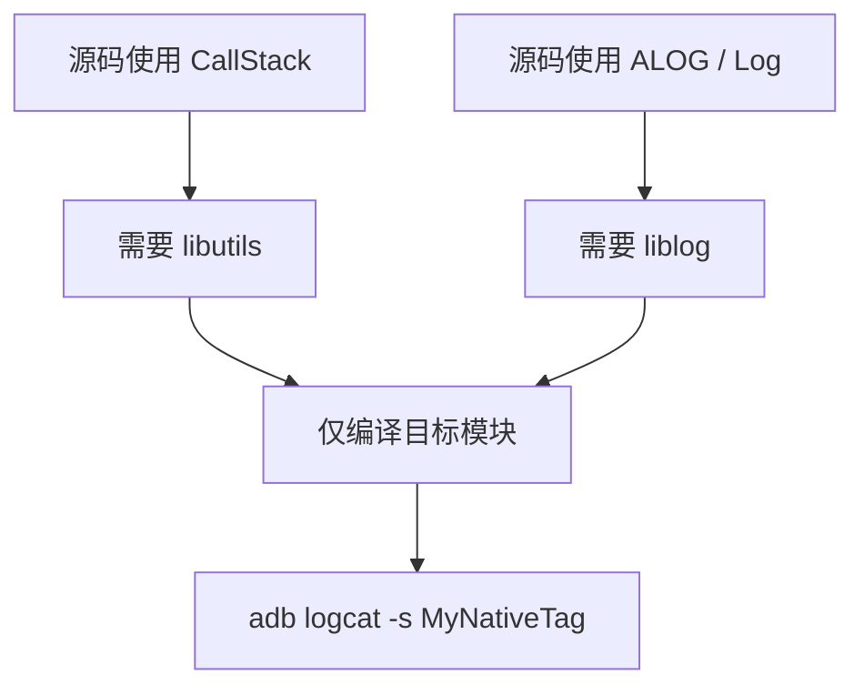

# Native 日志与调用栈：最小依赖的调试配置

> Native 调试不是把所有库都加进 `shared_libs`，而是让每个日志能力对应真实的源码依赖。

**Type:** Build
**Languages:** Python
**Prerequisites:** 01-boot-chain-and-bootanimation
**Time:** ~90 分钟

## 学习目标

- 解释 `LOG_NDEBUG` 的 0/1 含义
- 使用 `CallStack` 记录 Native 调用栈的前提
- 为日志和调用栈选择 `liblog` 与 `libutils`
- 说明符号、优化级别如何影响栈完整性
- 以目标模块编译和 Tag 过滤验证修改

## 概念

在采用 `LOG_NDEBUG` 的 C/C++ 文件中，`#define LOG_NDEBUG 0` 表示不禁用 debug 日志，`1` 表示禁用。`android::CallStack` 可以更新并打印当前栈，但栈是否完整取决于符号、优化和运行环境。



`libcutils` 不能因为“可能有用”就机械加入。正确方式是查看当前文件真正引用的 API，再在 Android.bp 的 `shared_libs` 中声明最小依赖。

## 构建它

`NativeModuleConfig` 根据是否使用日志与 CallStack 验证所需库，并输出可测试的缺失依赖。

```bash
cd phases/22-android-framework-system-basics/02-native-log-and-callstack/code
python3 main.py
python3 -m unittest discover tests -v
```

## 诊断练习

编译通过但没有预期日志时，依次确认宏值、Tag 过滤、模块是否被重新部署、二进制符号和运行的实际分区，而不是盲目提高日志等级。

## 发布它

Native 调试依赖检查卡见 `outputs/skill-native-log-callstack.md`。
