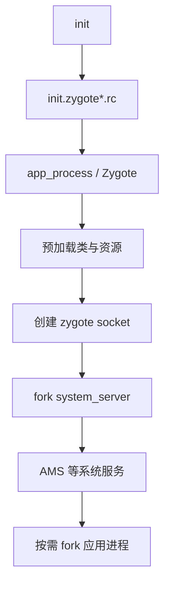

# Zygote 与 SystemServer：应用进程从哪里来

> 绝大多数 Android Java 进程并不是“自己启动”的，它们都是 Zygote fork 的后代。

**Type:** Build
**Languages:** Python
**Prerequisites:** 02-native-log-and-callstack
**Time:** ~90 分钟

## 学习目标

- 描述 init、Zygote、SystemServer 与应用进程的父子关系
- 解释 `ro.zygote` 如何选择 rc 配置
- 识别 `app_process64`、socket 与 `--start-system-server` 的角色
- 用设备命令检查 Zygote 进程与 socket
- 区分应用进程 fork 与 SystemServer fork 的时机

## 概念

init 根据 `ro.zygote` 导入相应 `init.zygote*.rc`，启动 `/system/bin/app_process64` 或 32 位版本。Zygote 预加载常用类和资源，创建 Unix domain socket，然后 fork SystemServer；AMS 等服务在需要时再请求 fork 应用进程。



设备端可通过 `adb shell ps -A | grep zygote`、`adb shell ls -l /dev/socket/zygote*` 和 system buffer 日志确认状态。实际 rc 文件和位数随设备配置变化。

## 构建它

`ZygoteRc.parse()` 提取简化 service 行；`ZygotePlanner` 输出从 init 到应用进程的顺序。

```bash
cd phases/22-android-framework-system-basics/03-zygote-and-system-server/code
python3 main.py
python3 -m unittest discover tests -v
```

## 诊断练习

应用无法启动时，先区分是 Zygote 没有启动、SystemServer 没有完成，还是包管理/Activity 启动失败。不要只从应用 logcat 的末尾倒推系统启动问题。

## 发布它

Zygote 启动链检查卡见 `outputs/skill-zygote-system-server.md`。
