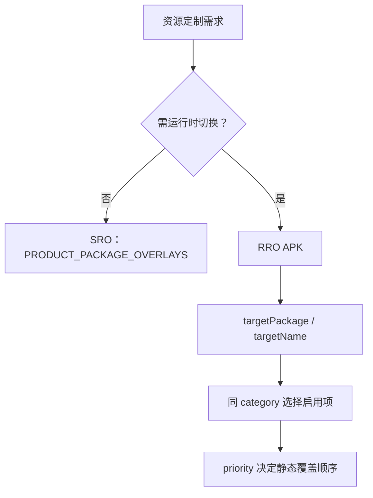

# 资源 Overlay：SRO、RRO 与类别互斥

> Overlay 是资源替换机制，不是任意修改业务逻辑的快捷方式。

**Type:** Build
**Languages:** Python
**Prerequisites:** 04-android-build-and-partition
**Time:** ~90 分钟

## 学习目标

- 区分 SRO 与 RRO 的生效时机和使用场景
- 解释 RRO 的 targetPackage、targetName、isStatic 与 priority
- 识别同一类别内的互斥启用规则
- 用命令查看和控制当前用户的 RRO
- 避免多个 Overlay 意外覆盖同一资源

## 概念

SRO（Static Resource Overlay）在编译或打包时用于固定产品定制；RRO（Runtime Resource Overlay）可在运行时按用户启停。RRO manifest 指向目标包及可选的 `overlayable` 分组。



导航模式等同类别通常通过 `setEnabledExclusiveInCategory()` 保证只有一个 Overlay 启用。设备端可用 `adb shell cmd overlay list --user current` 观察实际状态。

## 构建它

`OverlayRegistry` 按 category、enabled 与 priority 选择条目，并模拟 RRO 类别互斥；它不会调用设备命令。

```bash
cd phases/22-android-framework-system-basics/05-resource-overlays/code
python3 main.py
python3 -m unittest discover tests -v
```

## 诊断练习

资源没有生效时，先确认覆盖目录相对路径、目标包、当前用户、类别和优先级；不要先修改目标业务代码。

## 发布它

Overlay 检查卡见 `outputs/skill-overlay-resolution.md`。
