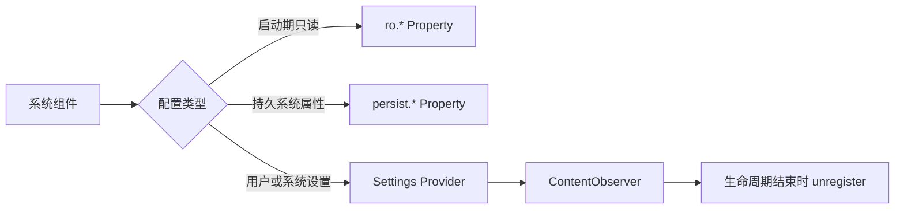

# 系统属性与跨进程设置：System Property、Settings 与 ContentObserver

> 配置跨进程传播的关键不是“写进某个字符串”，而是权限、作用域、观察者和生命周期。

**Type:** Build
**Languages:** Python
**Prerequisites:** 05-resource-overlays
**Time:** ~90 分钟

## 学习目标

- 区分 `ro.*` 与 `persist.*` 系统属性的写入边界
- 说明 property service 与 `property_contexts` 的角色
- 区分 Settings.System、Secure 与 Global 的权限范围
- 使用 ContentObserver 监听 Settings URI
- 在组件结束时注销观察者

## 概念

Java 系统组件可以通过 `android.os.SystemProperties` 访问系统属性，但普通第三方应用不应依赖隐藏 API。`ro.*` 在启动后只读；属性名称、值长度和 SELinux `property_contexts` 都受系统策略约束。



Settings 的 System、Secure、Global 表可写范围不同。`WRITE_SECURE_SETTINGS` 是签名/特权权限，不能仅靠 manifest 或 `sharedUserId` 获得。

## 构建它

`PropertyPolicy` 仅表达教学层的属性写入权限；`SettingsObserver` 用 URI 注册、写入通知和注销模拟 ContentObserver 生命周期。

```bash
cd phases/22-android-framework-system-basics/06-system-properties-and-settings/code
python3 main.py
python3 -m unittest discover tests -v
```

## 诊断练习

一个设置值改了但界面没更新时，依次检查写入表、URI 是否一致、观察者注册的 user、权限和 `unregisterContentObserver()` 是否过早执行。

## 发布它

属性与 Settings 检查卡见 `outputs/skill-properties-settings.md`。
