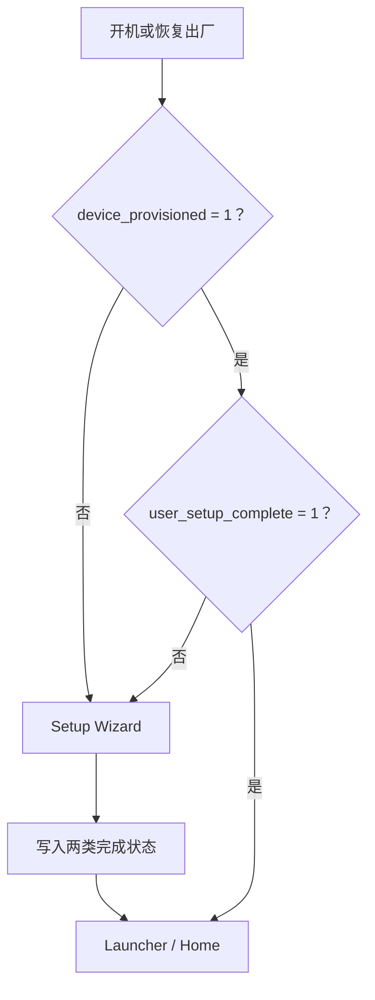

# 开机向导与 Provisioning：谁应该先看到 Home

> Setup Wizard 的正确性由设备级和用户级状态共同决定，不靠在普通 Activity 中调用 `System.exit(0)`。

**Type:** Build
**Languages:** Python
**Prerequisites:** 06-system-properties-and-settings
**Time:** ~90 分钟

## 学习目标

- 解释 `device_provisioned` 与 `user_setup_complete` 的差异
- 判断首次开机、恢复出厂设置和完成向导后的入口
- 验证 Setup Wizard Activity 的 Intent 类别
- 说明为什么不应盲目同时声明 `HOME`
- 在完成流程中正确更新状态并结束界面

## 概念

系统通过 `Settings.Global.DEVICE_PROVISIONED` 表示设备级初始化，通过 `Settings.Secure.USER_SETUP_COMPLETE` 表示当前用户完成向导。两个标记未全部完成时，产品流程通常仍应进入向导。



关键 Intent 类别是 `android.intent.category.SETUP_WIZARD`。为了增加匹配概率而同时声明 `HOME` 会参与桌面解析，可能与 Launcher 冲突。状态写入还需要正确系统权限、签名、allowlist 和 SELinux 策略。

## 构建它

`ProvisioningState` 返回下一入口并生成完成状态；`SetupIntentValidator` 要求 `MAIN` 与 `SETUP_WIZARD`，同时拒绝 `HOME`。

```bash
cd phases/22-android-framework-system-basics/07-setup-wizard-and-provisioning/code
python3 main.py
python3 -m unittest discover tests -v
```

## 诊断练习

测试 provisioning 前先使用可恢复设备。若设备重复进入向导，读取两个 Settings 值、当前用户、Activity Intent Filter 和系统日志，不要仅修改一个开关。

## 发布它

开机向导状态检查卡见 `outputs/skill-setup-wizard-provisioning.md`。
