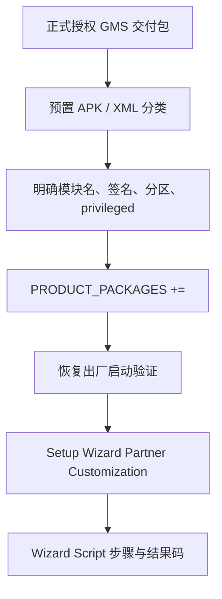

# GMS 集成与自定义向导适配

> GMS 是受授权和兼容性约束的产品集成工作；“能把 APK 放进镜像”不是交付完成。

**Type:** Build
**Languages:** Python
**Prerequisites:** 07-setup-wizard-and-provisioning
**Time:** ~90 分钟

## 学习目标

- 解释 GMS 集成需要匹配授权、版本、认证和分区策略
- 为预置 APK 明确模块名、证书、分区和特权标记
- 用 `prebuilt_etc` 安装配置文件
- 阅读 Partner Customization Receiver 的作用
- 用显式 Wizard Script 描述步骤和结果码

## 概念

量产产品必须使用与 Android 版本、认证和分区策略匹配的正式交付包，不能把来源不明的 Open GApps 当作商用方案。每个预编译 APK 都要声明安装分区、证书和特权属性；产品包列表应使用 `+=`，避免覆盖已存在配置。



Partner Receiver 是否需要、权限和资源 URI 取决于实际 Setup Wizard 版本。空 Receiver 不能完成适配；必须按交付版本提供所需资源和流程。

## 构建它

`PrebuiltPackage` 校验预置描述；`WizardScriptGraph` 显式解析 action 与 result code 的下一步；`partner_receiver_valid()` 检查必要广播 action。

```bash
cd phases/22-android-framework-system-basics/08-gms-integration-and-customization/code
python3 main.py
python3 -m unittest discover tests -v
```

## 诊断练习

验收应覆盖恢复出厂后的入口、返回/跳过、导航模式切换、状态写入、重启后不再进入向导，以及 GMS 应用首次启动。不要用未经许可的第三方包替代正式集成材料。

## 发布它

GMS 与向导集成检查卡见 `outputs/skill-gms-setup-integration.md`。
