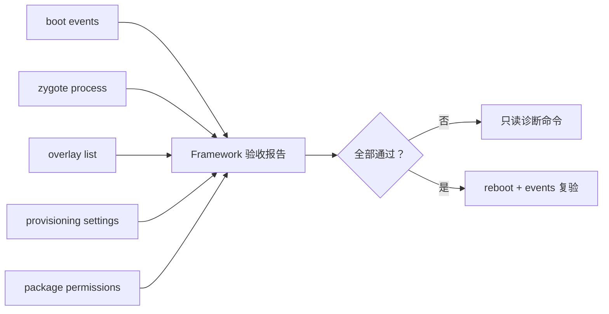

# Framework 集成验收实验室：把系统层证据连成闭环

> 最终验收不是看到 Launcher 就结束，而是确认启动、Zygote、Overlay、向导和权限各自都能被证明。

**Type:** Build
**Languages:** Python
**Prerequisites:** 08-gms-integration-and-customization
**Time:** ~90 分钟

## 学习目标

- 将系统启动、Zygote、Overlay、Setup Wizard 与权限拆成独立验收项
- 为每个失败项生成一条最小诊断命令
- 用只读命令优先收集设备证据
- 在全部条件满足后设计恢复出厂和重启验收
- 形成可复用的 Framework 定制交付清单

## 概念

本阶段的核心不是新增系统功能，而是把前 8 节的验证方法组合成闭环。每个层都必须有独立的观测点：启动事件、Zygote 进程、Overlay 列表、Provisioning 状态和包权限。



验收失败时不要同时改多个层。先以一条命令证实最早的失败条件，再回到对应课程的源代码、产品配置或权限策略中修复。

## 构建它

`FrameworkReadinessReport` 汇总五个必需检查，并按照最早缺口返回一条只读或低副作用的下一步命令。

```bash
cd phases/22-android-framework-system-basics/09-framework-integration-lab/code
python3 main.py
python3 -m unittest discover tests -v
```

## 阶段项目

用自己的 AOSP 产品配置填写启动、Overlay、向导和权限证据。先在模拟器或可恢复设备验证，再让每次变更只影响一个验收项。

## 发布它

Framework 集成验收模板见 `outputs/skill-framework-readiness.md`。
